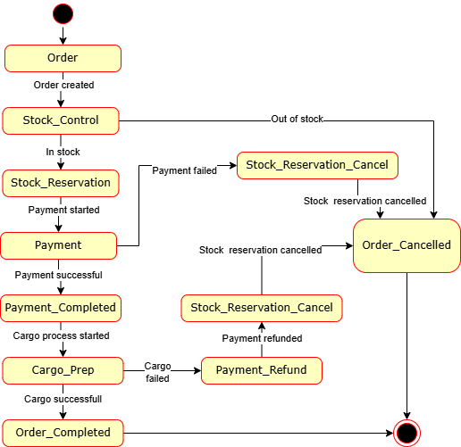

# Saga Patterns

### Saga pattern mikroservis mimarisinde hangi sorunları çözmeye çalışır?

Saga pattern, mikroservis mimarisinde her mikroservisin kendi veritabanına sahip olduğu ve bir işlemi yapmak için birlikte çalıştıkları **distributed transaction** problemini çözmek için kullanılır.

Saga pattern işlemi birbirini takip eden **local transaction**lara böler. Her mikroservis, kendinden önceki mikroservisin işlemini başarıyla tamamlaması sonrası çalışır. Bir işlem sırasında herhangi bir adım başarısız olursa daha önce tamamlanan adımlar **compensating transaction** ile adım adım geri alınır. Böylece sistem tutarlılığı korunur.

### Saga patterndeki choreography ve orchestration yaklaşımları arasındaki temel fark nedir?

Choreography yaklaşımında merkezi bir yönetici yoktur. Her mikroservis *event*leri dinler ve kendi işlemini tamamladıktan sonra yeni bir _event_ yayınlar. Böylece servisler birbirleriyle haberleşerek süreci yönetir.

Orchestration yaklaşımında ise merkezi bir **saga orchestrator** vardır. Orchestrator, tüm workflowu yönetir. Hangi servisin ne zaman çalışacağını belirler, servisleri sırasıyla çağırır ve hata oluştuğunda telafi işlemlerini başlatır.

Aralarındaki temel fark kontrolün dağılım şeklidir. Choreography’de servisler arasında dağınık, orchestration’da tek bir merkezde toplanmıştır.

### Orchestration Saga pattern avantajları ve dezavantajları nelerdir?

Avantajları:

- İş akışı tek bir merkezden yönetildiği için kolayca takip edilebilir

- Error handling ve telafi işlemleri daha düzenli şekilde gerçekleştirilebilir

- Bakım ve geliştirmesi daha kolaydır

- Servislerin çalışma sırası açıkça tanımlanabilir

Dezavantajları:

- Orchestrator merkezi bir bileşen olduğu için single point of failure oluşturabilir, oluşan bir hata yüzünden tüm sistem etkisiz hale gelebilir

- Orchestrator’un geliştirilmesi ve yönetilmesi ekstra karmaşıklık getirir

- Tüm mikroservisler orchestrator ile iletişim kurduğu için merkezi sisteme bağımlılık artar

- Yoğun veri trafiğinde performans düşüklüğü yaşanabilir

### Bir e-ticaret uygulaması tasarladığınızı düşünelim. Bu uygulamada müşteriler sipariş verdiklerinde, birden fazla hizmetin birlikte çalışması gerekiyor. Müşteri bir sipariş verdiğinde şu adımlar gerçekleşmeli:

1\. Stokta mevcut ürünleri kontrol eder ve onları rezerve eder.

2\. Müşterinin yeterli bakiye olup olmadığı kontrol edilir ve ödeme işlemi gerçekleştirilir.

3\. Kargo ödeme onaylandıktan sonra gönderi için hazırlık yapar ve teslimat planlanır.

Burada dikkat etmeniz gereken bir nokta var: Eğer bu adımlardan herhangi biri başarısız olursa (örneğin, ödeme başarısız olursa veya stokta ürün yoksa), sistem önceki adımları geri alarak verilerin tutarlılığını sağlamalıdır. Yani, ödeme başarısız olursa stoktaki rezerv kaldırılmalı, kargo işlemi başarısız olursa ödeme iade edilmelidir.

#### Bu süreci yönetmek için bir Saga pattern tasarlayın ve basit bir durum makinesi (state machine) diyagramı çizin. Sipariş Verildi aşamasından Sipariş Tamamlandı aşamasına kadar olan her bir durumu çizin ve her bir başarısızlık durumunda geri alma adımlarını gösterin.

#### Her bir durumda, ilgili hizmetin başarılı ya da başarısız olması durumunda nasıl bir geçiş yapılacağını açıklayın.

Adım 1) Müşteri siparişi verdi. Sipariş oluşturuldu.

Adım 2) **Stok Kontrolü**

Başarılı:

1.  Stokta ürün var.

2.  Sonraki adıma geçildi.

Başarısız:

1.  Stokta ürün yok.

2.  Sipariş iptal edildi.

Adım 3) Stok rezervasyonu yapıldı.

Adım 4) **Ödeme**

Başarılı:

1.  Ödeme başarıyla alındı.

2.  Sonraki adıma geçildi.

Başarısız:

1.  Ödeme alınamadı.

2.  Stok rezervasyonu geri çekildi.

3.  Sipariş iptal edildi.

Adım 5) Ödeme tamamlandı. Kargo işlemlerinin başlaması için onay verildi.

Adım 6) **Kargo Hazırlığı**

Başarılı:

1.  Kargo sorunsuzca hazırlandı.

2.  Sonraki adıma geçildi.

Başarısız:

1.  Kargo hazırlığında sorun çıktı.

2.  Ödeme iade edildi.

3.  Stok rezervasyonu geri çekildi.

4.  Sipariş iptal edildi.

Adım 7) Kargo gönderildi. Sipariş tamamlandı.
